# Exercice 1
Dans ce premier exercice, vous allez démarrer un projet Quarkus.

## Etape 1 : installer Quarkus

Quarkus propose différents modes d’exploitation :
- Maven
- Gradle
- Cli

Choisissez le mode qui vous convient et faites les installations nécessaires :

| Solution | Action                                  |
|:---------|:----------------------------------------|
| Maven    | Il n’y a rien à installer à part Maven  |
| Gradle   | Il n’y a rien à installer à part Gradle |
| Cli      | Il est nécessaire d’installer le Cli    |

## Etape 2 : Démarrer un projet

Allez sur https://code.quarkus.io

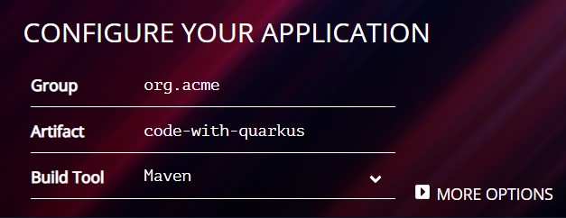

Renseignez le groupe et nom d’artefact désiré.

Choisissez entre Maven et Gradle.

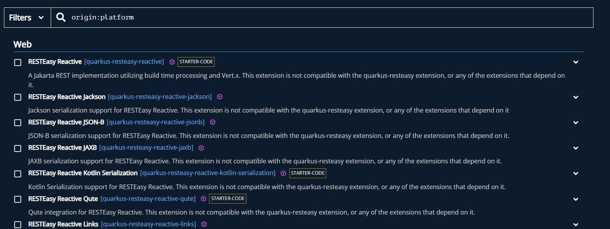

Vous pouvez aussi sélectionner des librairies pré intégrées par les équipes de Quarkus.

**Pour le TP, cela n’est pas nécessaire.**

Certaines librairies incluent même des starters permettant de les prendre en main.

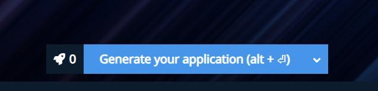

Une fois votre marché fait, vous pouvez générer votre projet

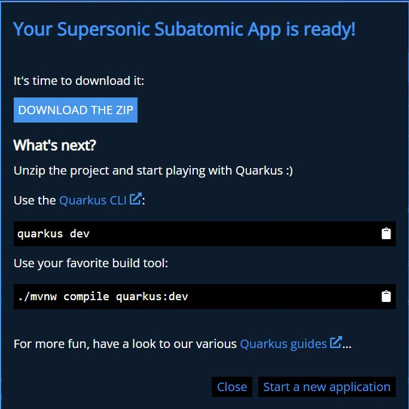

Une fois le projet généré, un popup permet de télécharger un zip contenant tout le projet.
Une fois téléchargé, le projet peut être importé dans votre IDE favori.

## Etape 3 : petit tour du proprio

Regardons les fichiers générés

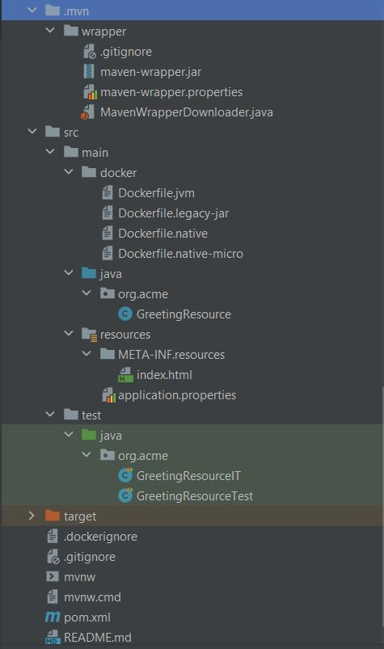

Le starter de base inclut :
- une chaine de build avec des templates Docker,
- un contrôleur,
- des tests,
- un gitignore,
- un readme,
- une configuration Maven ou Gradle en fonction de votre choix.

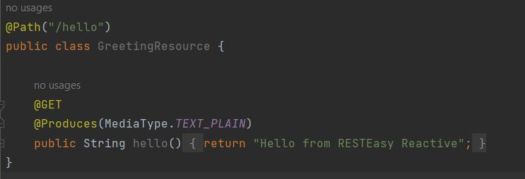

Le contrôleur du starter est un simple hello world avec une String en dur.

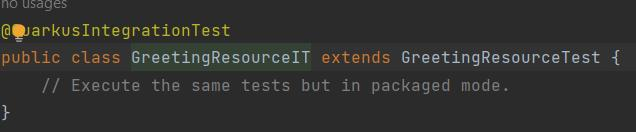

Un test d’intégration est également disponible. Malheureusement il est vide... Mais il existe. 😉

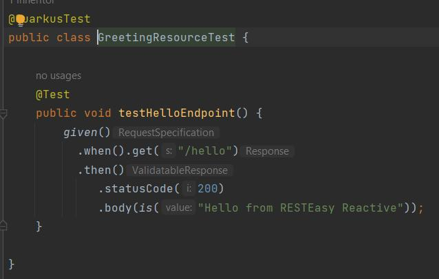

Un test unitaire est, quant à lui, bien disponible. Ce test est écrit en respectant la syntaxe Gherkin et ressemble plus à un test d’intégration.

Lançons notre application en mode dev.

| Méthode | Commande     |
|:---|:-------------|
| Cli | quarkus dev  |
| Maven | ./mvnw quarkus:dev |
| Gradle | ./gradlew --console=plain quarkusDev |

On constate que lors du lancement, l’application est buildée.
L’application en mode dev expose une URL http://localhost:8080

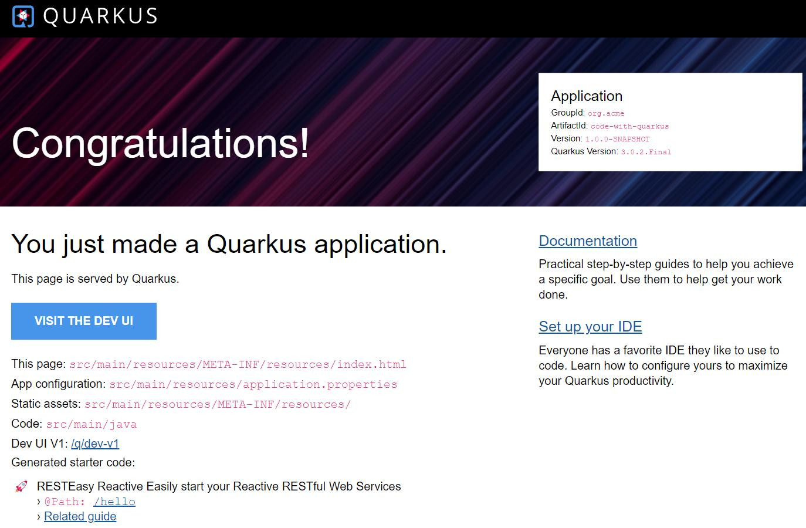

Cette URL permet d’accéder à divers éléments des starters.

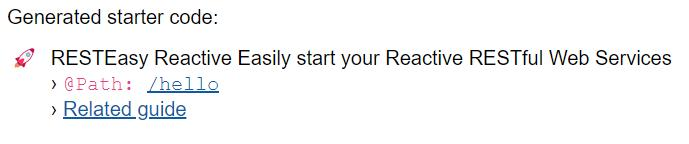

L'accès aux endpoints exposés par les contrôleurs de l’application :

L’accès à la console Dev UI.

Laissons de côté les endpoints des contrôleurs, dépendants du code produit, et concentrons-nous sur le dev UI.

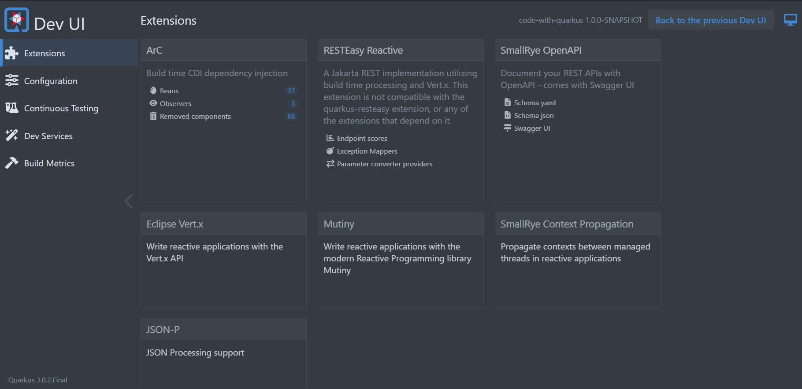

Le dev UI permet d’accéder à diverses sections depuis son menu

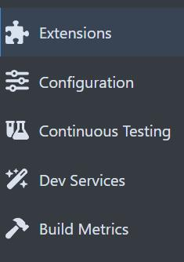

La section **Extensions** met en avant les modules installés en donnant accès aux configurations, endpoints et autres éléments.

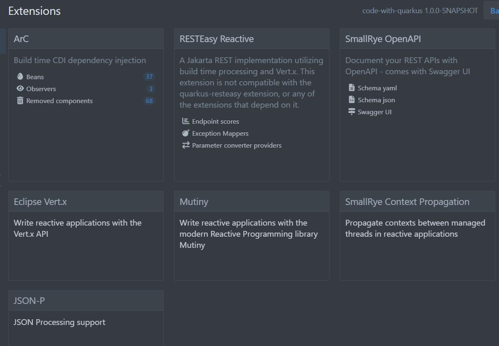

La section **Configuration** permet de manager les properties de l’application.

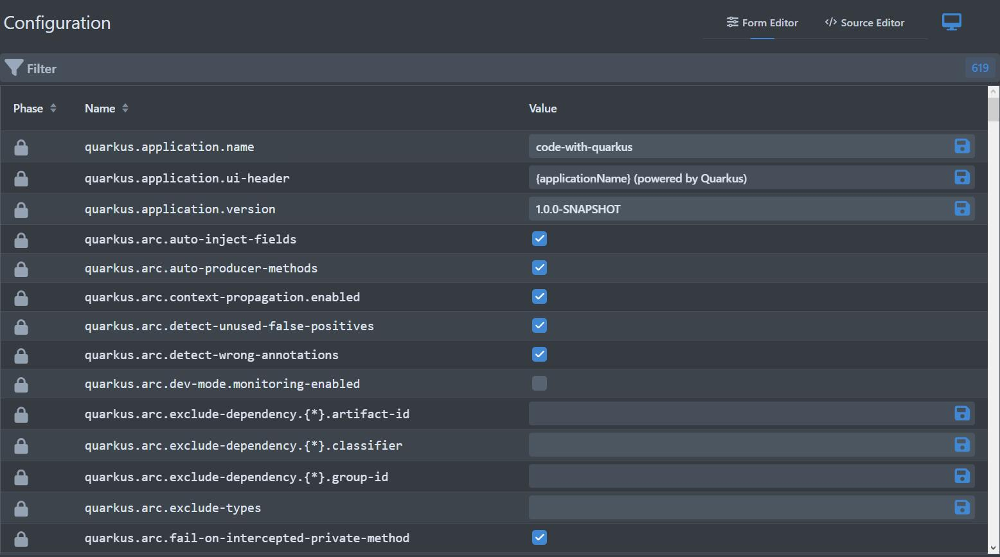

La section **Continuous Testing** permet de lancer le mode de test en continu. Une fois ce mode activé, toute modification du code relance les tests impactés par ce changement de code.

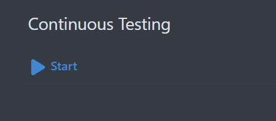

Par défaut ce mode n’est pas lancé

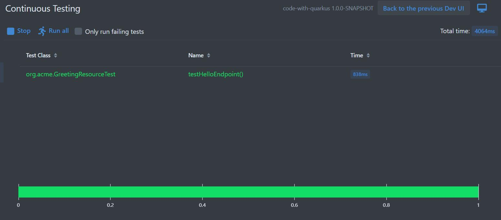

La section **Dev Services** permet le management des applications side kick telles qu’une base de données, permettant le développement.

Laissons notre application tourner parce que pourquoi pas.  
[ Exercice suivant ](https://github.com/trzebiatowskif/initiation-quarkus/blob/main/exercice-2/README.md)