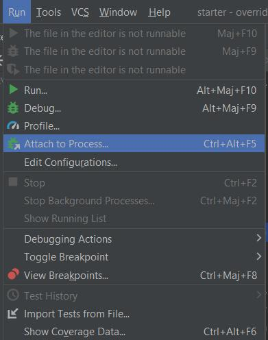
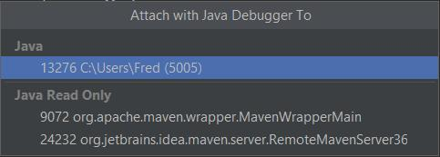

# Exercice 3 : Le mode débug

Il y a deux modes de debug :
- le debug “classique”,
- le remote debug.
Nous traiterons ces 2 modes distinctement.
## Le mode debug “classique”
Par mode debug “classique”, je désigne un debug en cours de dev.

Comme vu dans l’exercice précédent, l’application Quarkus est lancée via une ligne de commande et pas depuis une exécution depuis notre IDE favori. Il ne suffit pas de cliquer sur le bouton débug pour que cela marche.

Détaillons la procédure pour Intellij.



Dans le menu, aller dans le sous-menu run et sélectionner “Attach to Process...”

Une fenêtre de dialogue s’ouvre avec les process java en cours.



Sélectionner le process Quarkus, ici le 13276.

Le volet de debug s’ouvre et l’on peut débugger comme si de rien n’était.

## Le remote debug
**/!\ Docker est requis pour cette section**

Le remote debug est le fait de débugger des applications ne tournant pas en local.

Pour cela nous allons builder une version de l’application et la lancer dans un container Docker, en local oui, mais nous interagirons avec comme si ce container était sur un serveur distant.
### Build de l’application
Pour que cela fonctionne, il faut que l’application soit au format JVM et non native afin de pouvoir changer le bytecode à chaud.

Pour cela il faut lancer un build classique via la commande :
```shell
mvn clean package -Dquarkus.package.type=mutable-jar
```
### Construction de l’image
Pour que l’image puisse être disponible en remote debug, il faut créer un nouveau Dockerfile. Nommons le Dockerfile.dev.
```docker
FROM registry.access.redhat.com/ubi8/openjdk-17:1.14

ENV QUARKUS_LAUNCH_DEVMODE=true \
JAVA_ENABLE_DEBUG=true

COPY target/quarkus-app/lib/ /deployments/lib/
COPY target/quarkus-app/*.jar /deployments/
COPY target/quarkus-app/app/ /deployments/app/
COPY target/quarkus-app/quarkus/ /deployments/quarkus/

CMD ["java", "-jar", \
"-Dquarkus.http.host=0.0.0.0", \
"-Djava.util.logging.manager=org.jboss.logmanager.LogManager", \
"-Dquarkus.package.type=mutable-jar", \
"-Dquarkus.live-reload.password=123", \
"/deployments/quarkus-run.jar"]
```

quarkus.live-reload.password permet de limiter l’accès au remote debug aux personnes connaissant le mot de passe.

Pour builder l’image, il faut utiliser la commande :
```shell
docker build -f src/main/docker/Dockerfile.dev -t codelab .
```
### Lancement de l’application
L’application sera donc lancée en local sur docker avec la commande:
```shell
docker run --rm   --name codelab   -p 8080:8080   -p 5005:5005   codelab
```
### Passons en debug
Pour passer en remote debug, on doit démarrer un proxy en local qui fera le pont entre notre IDE favori et l’application distante.

Pour lancer le proxy, il faut utiliser la commande :
```shell
mvn quarkus:remote-dev -Ddebug=false   -Dquarkus.package.type=mutable-jar   -Dquarkus.live-reload.url=http://localhost:8080   -Dquarkus.live-reload.password=123
```
quarkus.live-reload.url doit taper sur l’url distante afin de permettre l’interaction avec l’applIcation remote.

quarkus.live-reload.password ce paramètre reprend le mot de passe mis dans notre image docker.

Ensuite, on repend le process du debug classique (attacher le process, mise à jour du code à chaud...)

[ Exercice suivant ](https://github.com/trzebiatowskif/initiation-quarkus/blob/main/exercice-4/README.md)