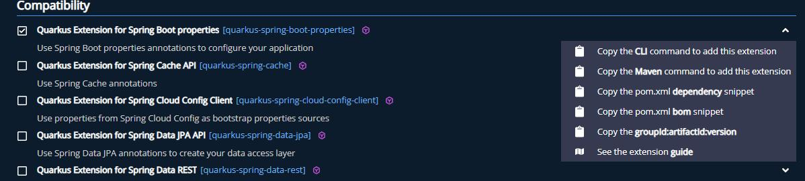
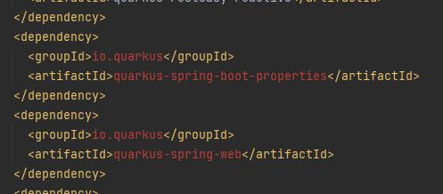

# Exercice 4 : ajoutons une extension
Dans cet exercice, nous allons ajouter une extension à un projet existant.
## Qu’est-ce qu’une extension ?
Une extension est une librairie maintenue par Quarkus. De ce fait, son intégration est simplifiée sans incompatibilité.

Il existe aussi des extensions “non officielle” disponible dans le quarkusverse
## Comment ajouter une extension ?
Sur le site qarkus.io que nous avons utilisé pour créer notre projet, il est possible d’avoir des commandes pour ajouter des extensions de façon automatique.



En cliquant sur le lien, la ligne de commande est directement copiée dans le presse-papier.

Ajoutons les extensions spring boot et spring web api.

Une fois les commandes exécutées le pom.xml a été modifié et nous avons les dépendances suivantes:



## Comment utiliser une extension ?
Une fois le projet à jour dans votre IDE favori, ajoutons une nouvelle classe.

```java
@RestController
public class SpringGreetingResource {

    @Autowired
    private GreetingService greetingService;

    @GetMapping(path = "/spring-hello")
    public String greeting() {
        return greetingService.hello();
    }
}
```

Oui les extensions utilisées permettent d’utiliser des annotation Spring dans une application Quarkus et on peut mixer avec notre service initialisé via Jakarta.

**NB** : toutes les annotations Spring ne sont pas supportées, il y a donc une limitation aux rêves. 😉

Lançons l’application.

Nous rencontrons une erreur au lancement
```
Spring Web can only work if 'quarkus-resteasy-jackson' or 'quarkus-resteasy-reactive-jackson' is present
```

Comme dit plutôt, les extensions officielles Quarkus sont compatibles. En cas d’extension manquante, on nous dit explicitement quelle extension manque.

Ajoutons l'extension 'quarkus-resteasy-jackson'.

Appelons l’URL http://localhost:8080/spring-hello. Nous obtenons la même réponse que pour http://localhost:8080/hello, le service exploité étant le même.